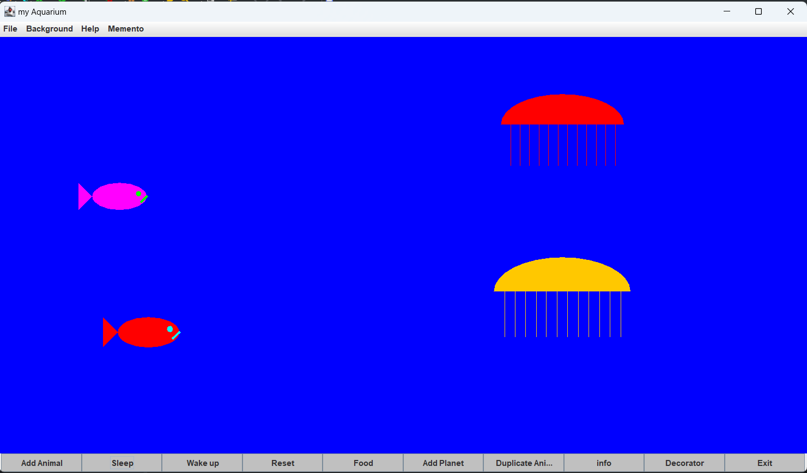

# Aquarium
This is the fourth exercise in the course, an extension of the third exercise – "Fish and Jellyfish Aquarium".

# Overview
The exercise focuses on the implementation of several design templates using the code and GUI that you have previously implemented.

# Objectives
Implementation of several design templates.
Integrating the design templates with the realization of the third work.

## Environment Variables

To run this project, you will need to add the following environment variables to your .env file

`JDK`

`JAVA Swing`

##image:

